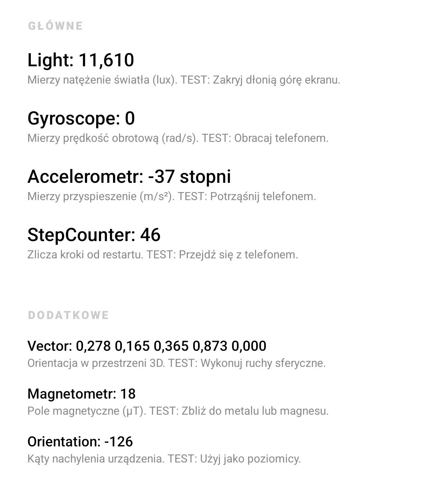
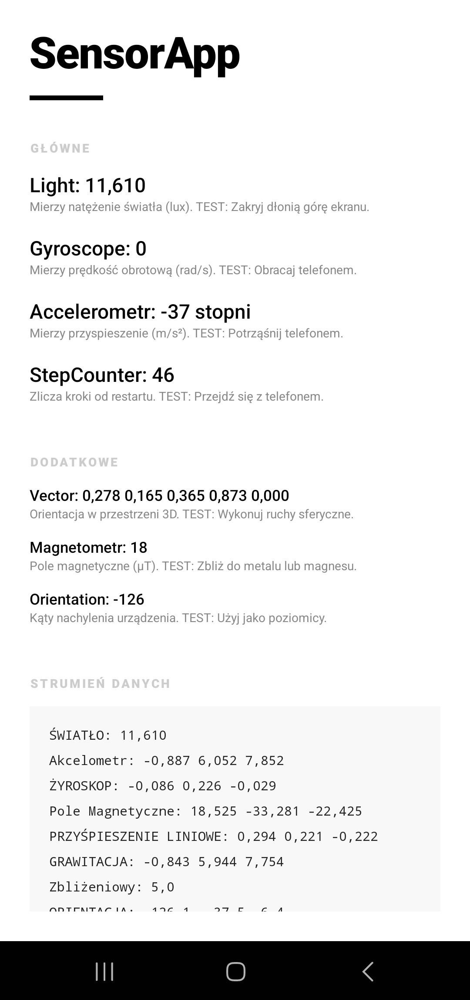
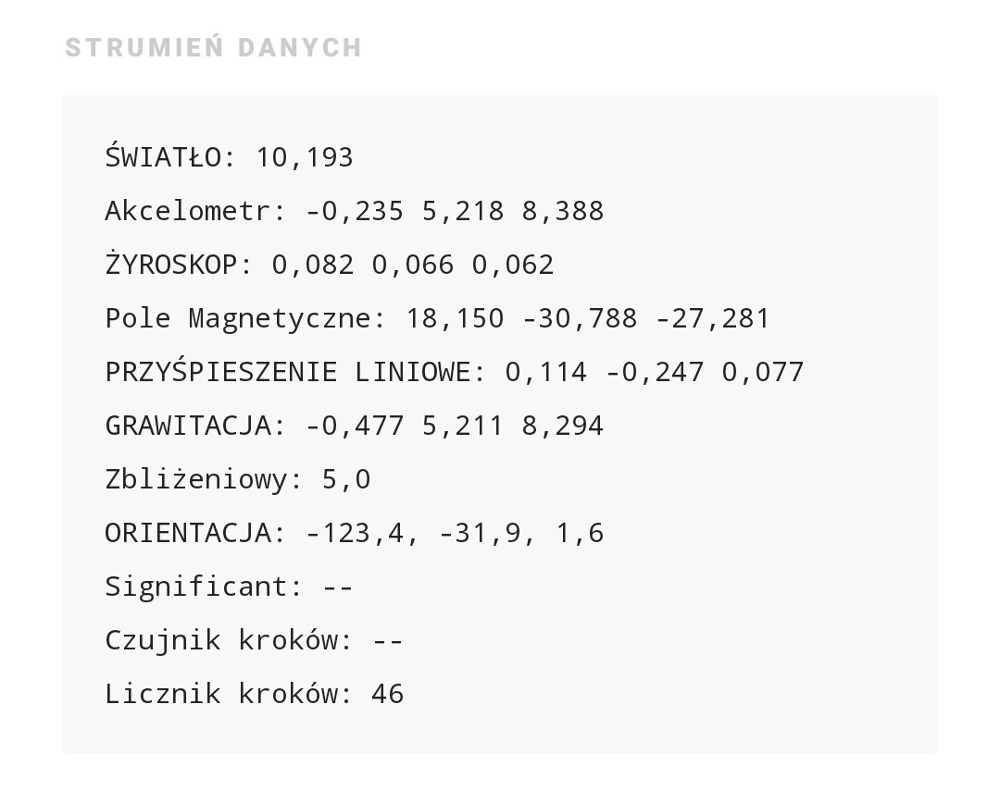

# SensorApp 🚀

Kompleksowa aplikacja diagnostyczna na system Android, umożliwiająca monitorowanie i testowanie wszystkich czujników sprzętowych urządzenia w czasie rzeczywistym. Zaprojektowana z naciskiem na czytelność danych inżynierskich i nowoczesny, minimalistyczny interfejs użytkownika.

## 📱 Prezentacja Aplikacji

| Główne Odczyty | Strumień Danych (Raw) | Wykaz Sprzętu |
|:---:|:---:|:---:|
|  |  |  |

## ✨ Kluczowe Funkcje

Aplikacja monitoruje szerokie spektrum sensorów, podzielonych na intuicyjne sekcje:

### 🛠 Sekcja GŁÓWNE
*   **Światło (Light)**: Pomiar natężenia oświetlenia otoczenia w luksach (lx).
*   **Żyroskop (Gyroscope)**: Precyzyjny pomiar prędkości obrotowej urządzenia.
*   **Akcelerometr (Accelerometer)**: Monitorowanie przyspieszenia liniowego w trzech osiach.
*   **Licznik kroków (Step Counter)**: Zliczanie kroków wykonanych przez użytkownika (wymaga uprawnienia ACTIVITY_RECOGNITION).

### 🔍 Sekcja DODATKOWE
*   **Wektor Rotacji**: Zaawansowane dane o orientacji 3D urządzenia.
*   **Magnetometr**: Pomiar pola magnetycznego otoczenia (przydatne jako kompas).
*   **Orientacja**: Obliczone kąty nachylenia (azymut, pochylenie, obrót).
*   **Significant Motion**: Inteligentny czujnik wykrywający rozpoczęcie przemieszczania się.

### 📟 STRUMIEŃ DANYCH (RAW DATA)
Podgląd surowych, niskopoziomowych danych bezpośrednio ze sterowników urządzenia (m.in. przyspieszenie liniowe, grawitacja, czujnik zbliżeniowy).

## 🧪 Jak Testować?

Każdy czujnik posiada wbudowaną w aplikację instrukcję testu:
1.  **Światło**: Zakryj dłonią górną część ekranu.
2.  **Akcelerometr**: Potrząśnij energicznie telefonem.
3.  **Licznik kroków**: Przejdź się (min. 10-15 kroków dla kalibracji).
4.  **Significant Motion**: Wstań i przejdź kilka metrów.
5.  **Magnetometr**: Zbliż telefon do metalowego przedmiotu.

## ⚙️ Techniczne Detale

*   **Język**: Java
*   **Interfejs**: XML (Custom Bold Minimal Style)
*   **API**: Android Sensor Framework (`SensorManager`, `SensorEventListener`, `TriggerEventListener`)
*   **Zarządzanie Energią**: Automatyczne rejestrowanie/wyrejestrowanie czujników w cyklach `onResume` i `onPause` w celu ochrony baterii.
*   **Logi**: Zaawansowane logowanie diagnostyczne z tagiem `mysensors` dostępne w LogCat.

## 🚀 Uruchomienie i Rozwój

1. Sklonuj repozytorium.
2. Otwórz w Android Studio.
3. Po uruchomieniu na telefonie zaakceptuj uprawnienia do **Aktywności Fizycznej** (wymagane dla krokomierza).
4. Aby filtrować logi, wpisz `mysensors` w wyszukiwarkę LogCat.

---
*Projekt stworzony w ramach ćwiczeń z programowania sensorów w systemie Android.*
